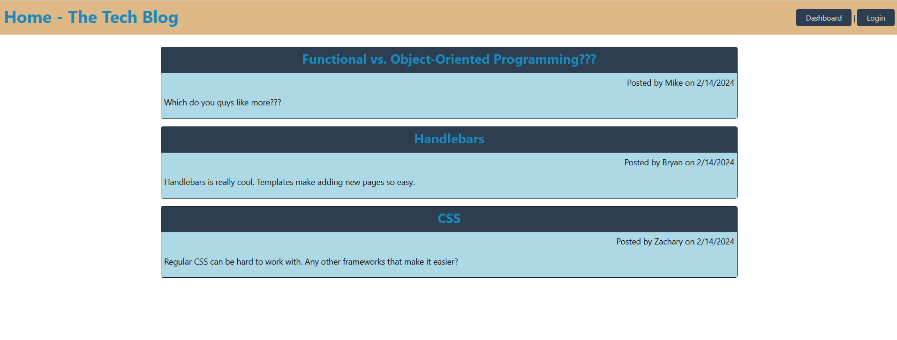

# tech-blog

## Description

This project aimed to create a fullstack tech blog website with a responsive front and backend connected to an active database. 

When visiting the site the user is presented with a homepage posts from other users and navigation links to the dasboard and login. If not already logged in the user will be redirected to the login/signup page. Logging in or signing up as a new user will redirect the user to the dashboard. From the dashboard the user can make new posts and view, update or delete existing posts they created. Clicking on the title of a post from either the dashboard or the homepage will redirect the user to the individual post. One that post's page the user can view comments on that post or post a new comment if they are logged in.

The project combined api Routes to modify and set content on the page including get, post, put, and delete with home Routes to serve the frontend HTML with updated data as the user interacts with it. A handlebars template was used to easily format data for each of the individual pages. Finally the project used a connected database to store user data including logins and post data which could be displayed on the site.

## Usage

The repo of the project can be found at https://github.com/mgberrysd/tech-blog

A live version of the site can be found at https://afternoon-refuge-24103-b0fa60b9886f.herokuapp.com/

When on the home page the user should see the following:

## Credits

This project used the unit 14 mini project as well as the Breaking Bread project 2 as a basis. Much of the file structure is identical to those projects, although many pages were either added, removed, or heavily modified for use in this project. The login/sign up pages and helper utils remained mostly unchanged.

The project used a number of node packages including Express, mysql2, Sequelize, dotenv, bcrypt, and handlebars to create the site.